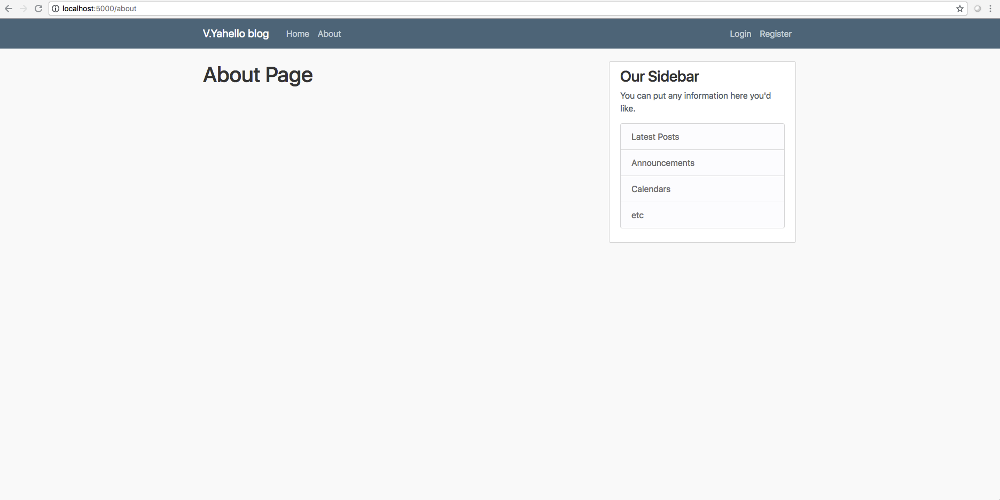

# Blog template
Basic blog web application written in [_flask_](http://flask.palletsprojects.com/en/1.1.x/) python mirco-web framework.

## Structure
### Home Page

### About Page

### Login Page

### Register Page


## Run a blog
Execute next command in your shell
```bash
~ python blog.py
```

## Run automated tests
- To run all tests please execute `./run-tests all` from shell in the root directory of the repository.
- To run basic smoke tests please execute `./run-tests smoke` from shell in the root directory of the repository.
- To run performance tests please execute `./run-tests performance` from shell in the root directory of the repository.
- To run unittests please execute `./run-tests unittest` from shell in the root directory of the repository.

### Testing report
- Open `tests/resuls/test-report.html` file after tests execution

## Advanced usage with docker
Use `vyahello/flask-blog:1.0.0` docker image to run a flask blog
```bash
~ docker run --rm -it -p 5000:5000 --name=flask-blog vyahello/flask-blog:1.0.0
```
Use `vyahello/flask-blog-at-tests:1.0.0` docker image to run automated tests for a flask blog. Grab test results after a test run in `results/` directory in your current working directory.
```bash
~ docker run --rm -it --net=host --name=flask-blog-at-tests vyahello/flask-blog-at-tests:1.0.0
```
Use `docker-compose.yaml` file to run firstly flask blog and then automated tests. Grab test results after a test run in `results/` directory in your current working directory
```bash
~ docker-compose -p flask-services up
```

## Contributing
- clone the repository
- configure Git for the first time after cloning with your name and email
  ```bash
  git config --local user.name "Volodymyr Yahello"
  git config --local user.email "vyahello@gmail.com"
  ```
- `python3.6` is required to run the code
- run `pip install -r requirements-blog.txt` to install all flask blog required python packages
- run `pip install -r requirements-at-tests.txt` to install all automated tests flask blog required python packages
